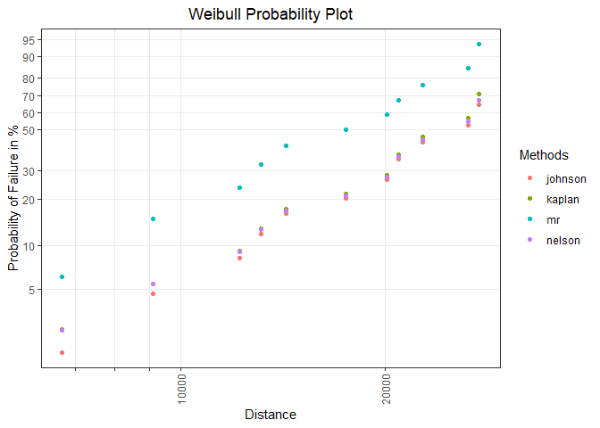
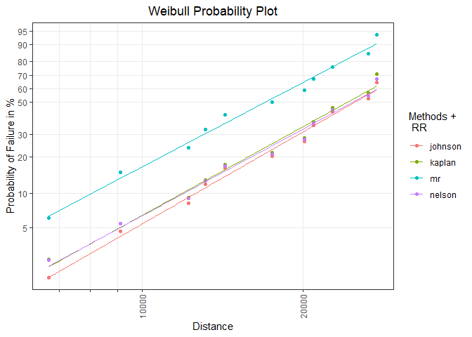

<!-- README.md is generated from README.Rmd. Please edit that file -->

# weibulltools 

<!-- badges: start -->

[](https://www.tidyverse.org/lifecycle/#maturing)
[](https://CRAN.R-project.org/package=weibulltools)
[](https://github.com/Tim-TU/weibulltools/actions)
<!-- badges: end -->

## Overview

The {weibulltools} package focuses on statistical methods and
visualizations that are often used in reliability engineering. It
provides a compact and easily accessible set of methods and
visualization tools that make the examination and adjustment as well as
the analysis and interpretation of field data (and bench tests) as
simple as possible.

Besides the well-known Weibull analysis, the package supports multiple
lifetime distributions and also contains Monte Carlo methods for the
correction and completion of imprecisely recorded or unknown lifetime
characteristics.

Plots are created statically {[ggplot2](https://ggplot2.tidyverse.org/)}
or interactively {[plotly](https://plotly.com/r/)} and can be customized
with functions of the respective visualization package.

## Installation

The latest released version of {weibulltools} from
[CRAN](https://CRAN.R-project.org/package=weibulltools) can be installed
with:

``` r
install.packages("weibulltools")
```

### Development version

Install the development version of {weibulltools} from
[GitHub](https://github.com/Tim-TU/weibulltools/) to use new features or
to get a bug fix.

``` r
# install.packages("devtools")
devtools::install_github("Tim-TU/weibulltools")
```

## Usage

### Getting started

Create consistent reliability data with columns:

-   `x` - lifetime characteristic  
-   `status` - binary data (0 for censored units and 1 for failed units)
-   `id` (optional) - identifier for units

``` r
library(weibulltools)

rel_tbl <- reliability_data(data = shock, x = distance, status = status)
rel_tbl
#> Reliability Data with characteristic x: 'distance':
#> # A tibble: 38 x 3
#>       x status id   
#>   <int>  <dbl> <chr>
#> 1  6700      1 ID1  
#> 2  6950      0 ID2  
#> 3  7820      0 ID3  
#> 4  8790      0 ID4  
#> 5  9120      1 ID5  
#> # ... with 33 more rows
```

### Probability estimation and visualization

Estimation of failure probabilities using different non-parametric
methods:

``` r
prob_tbl <- estimate_cdf(x = rel_tbl, methods = c("mr", "kaplan", "johnson", "nelson"))
#> The 'mr' method only considers failed units (status == 1) and does not retain intact units (status == 0).
prob_tbl
#> CDF estimation for methods 'mr', 'kaplan', 'johnson', 'nelson':
#> # A tibble: 125 x 6
#>   id        x status  rank   prob cdf_estimation_method
#>   <chr> <int>  <dbl> <dbl>  <dbl> <chr>                
#> 1 ID1    6700      1     1 0.0614 mr                   
#> 2 ID5    9120      1     2 0.149  mr                   
#> 3 ID13  12200      1     3 0.237  mr                   
#> 4 ID15  13150      1     4 0.325  mr                   
#> 5 ID19  14300      1     5 0.412  mr                   
#> # ... with 120 more rows
```

Visualization of the obtained results in a distribution-specific
probability plot:

``` r
prob_vis <- plot_prob(x = prob_tbl, distribution = "weibull", 
                      title_main = "Weibull Probability Plot", 
                      title_x = "Distance", 
                      title_y = "Probability of Failure in %", 
                      title_trace = "Methods",
                      plot_method = "gg")
prob_vis
```



### Model estimation and visualization

Parametric model estimation with respect to the used methods:

``` r
rr_list <- rank_regression(x = prob_tbl, distribution = "weibull")
rr_list
#> List of 4 model estimations:
#> Rank Regression
#> Coefficients:
#>      mu    sigma  
#> 10.2596   0.3632  
#> Method of CDF Estimation: johnson 
#> 
#> Rank Regression
#> Coefficients:
#>      mu    sigma  
#> 10.2333   0.3773  
#> Method of CDF Estimation: kaplan 
#> 
#> Rank Regression
#> Coefficients:
#>     mu   sigma  
#> 9.8859  0.3956  
#> Method of CDF Estimation: mr 
#> 
#> Rank Regression
#> Coefficients:
#>      mu    sigma  
#> 10.2585   0.3852  
#> Method of CDF Estimation: nelson
```

Model visualization in an existing probability plot:

``` r
mod_vis <- plot_mod(p_obj = prob_vis, x = rr_list, distribution = "weibull", 
                    title_trace = "RR") 
mod_vis
```



## Getting help

If you notice a bug or have suggestions for improvements, please submit
an issue with a minimal reproducible example on
[GitHub](https://github.com/Tim-TU/weibulltools/issues). For further
questions, please contact [Tim-Gunnar
Hensel](mailto:tim-gunnar.hensel@tu-berlin.de).
