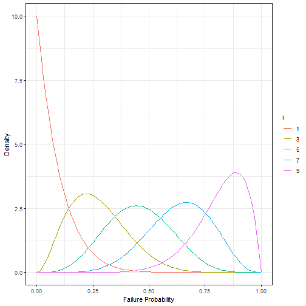
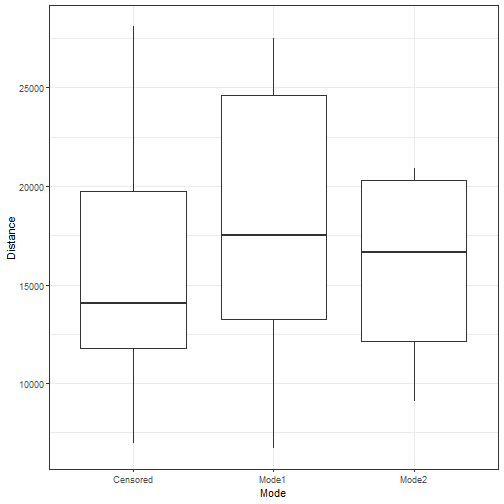
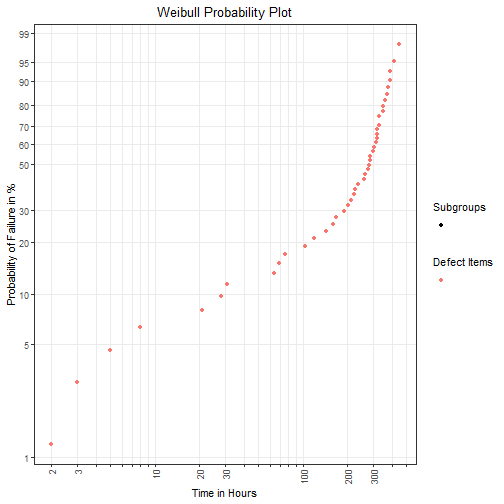
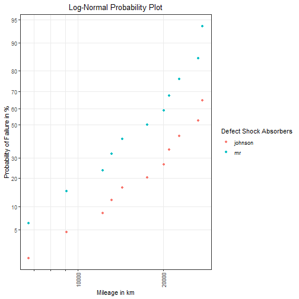

This document presents non-parametric methods for estimating the failure probabilities of units and their presentation in interactive visualizations. A unit can be a single component, an assembly or an entire system. 

## Introduction to Life Data Analysis

If the lifetime of a unit is considered to be a continuous random variable _T_, then the probability that a unit has failed by a certain point in time or a distance _t_ is defined by its CDF _(cumulative distribution function)_ _F(t)_.

$$ P(T\leq t) = F(t) $$

In order to obtain an estimate of the cumulative failure probability for each observation $t_1, t_2, ..., t_n$ two approaches are possible. Using a parametric lifetime distribution requires that the underlying assumptions for the sample data are valid. If the distribution-specific assumptions are correct, the model parameters can be estimated and the CDF is computable. But if the required conditions could not be met, interpretations and derived conclusions are not reliable. A more general approach for the calculation of the cumulative failure probability is to use non-parametric statistical estimators $\hat{F}(t_1), \hat{F}(t_2), ..., \hat{F}(t_n)$. In comparison to a parametric distribution no general assumptions must be held. For non-parametric estimators, an ordered sample of size n is needed. Starting at 1, the ranks $i \in \{1, 2, ..., n \}$ are assigned to the ascending sorted sample values. Since there is a known relationship between ranks and corresponding ranking probabilities a CDF can be calculated.  

But rank distributions are systematically skewed distributions and thus the median value instead of the expected value $E\left[F\left(t_i\right)\right] = \frac{i}{n + 1}$ is used for estimation [^note1]. This skewness is visualized in _Figure 1_. 


```r
library(tidyverse) # using dplyr manipulation functions and ggplot2
#> Warning: Paket 'tibble' wurde unter R Version 4.0.3 erstellt

x <- seq(0, 1, length.out = 100) # CDF
n <- 10 # sample size
i <- c(1, 3, 5, 7, 9) # ranks
r <- n - i + 1 # inverse ranking

df_dens <- expand.grid(cdf = x, i = i) %>% 
  mutate(n = n, r = n - i + 1, pdf = dbeta(x = x, shape1 = i, shape2 = r))

densplot <- ggplot(data = df_dens, aes(x = cdf, y = pdf, colour = as.factor(i))) + 
  geom_line() + 
  scale_colour_discrete(guide = guide_legend(title = "i")) + 
  theme_bw() + 
  labs(x = "Failure Probability", y = "Density")
densplot
```



[^note1]: Kapur, K. C.; Lamberson, L. R.: _Reliability in Engineering Design_, 
          _New York: Wiley_, 1977, pp. 297-301  

### Failure Probability Estimation  

In practice, a simplification for the calculation of the median value, also called median rank, is made. The formula of _Benard's Approximation_ is given by 

$$\hat{F}(t_i) \approx \frac{i - 0,3}{n + 0,4} $$ 

and is described in _The Plotting of Observations on Probability Paper _ [^note2]. 

[^note2]: Benard, A.; Bos-Levenbach, E. C.: _The Plotting of Observations on Probability Paper_, 
          _Statistica Neerlandica 7 (3)_, 1953, pp. 163-173  
          
However, this equation only provides valid estimates for failure probabilities if all units in the sample are defectives (`estimate_cdf(methods = "mr", ...)`).

In field data analysis, however, the sample mainly consists of intact units and only a small fraction of units failed. Units that have no damage at the point of analysis and also have not reached the operating time or mileage of units that have already failed, are potential candidates for future failures.  As these, for example, still are likely to fail during a specific time span, like the guarantee period, the failure probability must be adjusted upwards by these potential candidates.  

A commonly used method for correcting probabilities of (multiple) right censored data is Johnson's method (`estimate_cdf(methods = "johnson", ...)`). By this method, all units that fall into the period looked at are sorted in an ascending order of their operating time or mileage. If there are units that have not failed before the _i_-th failure, an adjusted rank for the _i_-th failure is formed. This correction takes the potential candidates into account and increases the rank number. In consequence, a higher rank leads to a higher failure probability. This can be seen in _Figure 1_.
  
The rank adjustment (`calculate_ranks()`) is calculated as follows: 

$$j_i = j_{i-1} + x_i \cdot I_i, \;\; with \;\; j_0 = 0$$

Here, $j_ {i-1}$ is the adjusted rank of the previous failure, $x_i$ is the number of defectives at time/distance $t_i$ and $I_i$ is the increment that corrects the rank by the candidates. 

$$I_i=\frac{(n+1)-j_{i-1}}{1+(n-n_i)}$$

The sample size is $n$ and $n_i$ is the number of units that have a lower operating time/mileage than the _i_-th unit. Once the adjusted ranks are calculated, the failure probabilities can be estimated according to _Benard's Approximation_.  

Other methods in `weibulltools` that can also handle (multiple) right censored data are the Kaplan-Meier estimator (`estimate_cdf(methods = "kaplan")`) and the Nelson-Aalen estimator (`estimate_cdf(method = "nelson")`). 

### Probability Plotting  

After computing failure probabilities a method called _Probability Plotting_ is applicable. It is a graphical _goodness of fit_ technique that is used in assessing whether an assumed distribution is appropriate to model the sample data.  

The axes of a probability plot are transformed in such a way that the CDF of a specified model is represented through a straight line. If the plotted points (`plot_prob()`) fall on an approximately straight line it can be said that the chosen distribution is adequate.  

The two-parameter Weibull distribution can be parameterized with $\eta$ and $\beta$ such that the CDF is characterized by the following equation:  

$$F(t)=1-\exp\left[ -\left(\frac{t}{\eta}\right)^{\beta}\right]$$

Then a linearized version of the CDF is: 

$$ \log\left[-\log(1-F(t))\right] = \beta \cdot \log(t) - \beta \cdot \log(\eta)$$

This leads to the following transformations regarding the axes: 

* Abscissa: $x = \log(t)$ 
* Ordinate: $y = \log\left[-\log(1-F(t))\right]$.

Another version of the Weibull CDF such that the distribution is part of the log-location-scale family with parameters $\mu$ and $\sigma$ is:  

$$F(t)=\Phi_{SEV}\left(\frac{\log(t) - \mu}{\sigma}\right)$$

A linearized representation of this CDF is: 

$$\Phi^{-1}_{SEV}\left(F(t)\right)=\frac{1}{\sigma} \cdot \log(t) - \frac{\mu}{\sigma}$$

This leads to the following transformations regarding the axes: 

* Abscissa: $x = \log(t)$ 
* Ordinate: $y = \Phi^{-1}_{SEV}\left(F(t)\right)$, which is the quantile function of the 
  SEV (_smallest extreme value_) distribution.  
  
It can be easily seen that the parameters can be converted into each other. The corresponding equations are: 

$$\beta = \frac{1}{\sigma} \;\; and $$  

$$\eta = \exp\left(\mu\right).$$   

## Data: shock

To apply the introduced methods of non-parametric failure probability estimation and probability plotting the `shock` data taken from `SPREDA` package is used. In this dataset kilometer-dependent problems that have occurred on shock absorbers are reported. In addition to failed items the dataset also contains non-defectives, so called *censored* observations. The data can be found in _Statistical Methods for Reliability Data_ [^note3]. 

[^note3]: Meeker, W. Q.; Escobar, L. A.: _Statistical Methods for Reliability Data_, 
          _New York, Wiley series in probability and statistics_, 1998, p. 630


```r
library(SPREDA) # for dataset shock
#> Warning: Paket 'SPREDA' wurde unter R Version 4.0.3 erstellt
data(shock)
# generate random ids for units: 
shock$id <- sample(c(letters, LETTERS), size = nrow(shock), replace = FALSE)

# using tibble for better print: 
as_tibble(shock)
#> # A tibble: 38 x 4
#>    Distance Mode     Censor id   
#>       <int> <fct>     <dbl> <chr>
#>  1     6700 Mode1         1 j    
#>  2     6950 Censored      0 N    
#>  3     7820 Censored      0 D    
#>  4     8790 Censored      0 X    
#>  5     9120 Mode2         1 y    
#>  6     9660 Censored      0 p    
#>  7     9820 Censored      0 f    
#>  8    11310 Censored      0 o    
#>  9    11690 Censored      0 l    
#> 10    11850 Censored      0 L    
#> # ... with 28 more rows

# Comparison of failure modes: 
ggplot(data = shock, aes(x = Mode, y = Distance)) + 
  geom_boxplot() + 
  theme_bw()
```



## Estimation of Failure Probabilities with Package `weibulltools`

For reasons of simplicity we will ignore the differences between the failure modes _Mode1_ and _Mode2_ which are shown in _Figure 2_. Thus, we will act as there is only one mechanism of damage.  

First, we are interested in how censored observations influence the estimation of failure probabilities in comparison to the case where only failed units are considered. 
In the latter case we will use the function `estimate_cdf()` with `methods = "mr"`. To deal with survived and failed units we will use `estimate_cdf()` with `methods = "johnson"`. In order to use `estimate_cdf` we must convert the `shock` dataset to an appropriate format using the function `reliability_data()`.  


```r
# Extract failure data from shock
failure_tbl <- reliability_data(shock, x = Distance, status = Censor, id = id)
failure_tbl
```

Reliability Data:
# A tibble: 38 x 3
       x status id   
   <int>  <dbl> <chr>
 1  6700      1 j    
 2  6950      0 N    
 3  7820      0 D    
 4  8790      0 X    
 5  9120      1 y    
 6  9660      0 p    
 7  9820      0 f    
 8 11310      0 o    
 9 11690      0 l    
10 11850      0 L    
# ... with 28 more rows

```r

# Estimate CDF
tbl_cdf <- estimate_cdf(failure_tbl, methods = c("mr", "johnson"))
#> The 'mr' method only considers failed units (status == 1) and does not retain intact units (status == 0).

# First case where only failed units are taken into account:
tbl_cdf_mr <- tbl_cdf %>% filter(method == "mr")

knitr::kable(tbl_cdf_mr, format = "html", row.names = FALSE, align = "c", 
             caption = "Table 1: Failure probabilities using failed items.")
```

<table>
<caption>Table 1: Failure probabilities using failed items.</caption>
 <thead>
  <tr>
   <th style="text-align:center;"> id </th>
   <th style="text-align:center;"> x </th>
   <th style="text-align:center;"> status </th>
   <th style="text-align:center;"> rank </th>
   <th style="text-align:center;"> prob </th>
   <th style="text-align:center;"> method </th>
  </tr>
 </thead>
<tbody>
  <tr>
   <td style="text-align:center;"> j </td>
   <td style="text-align:center;"> 6700 </td>
   <td style="text-align:center;"> 1 </td>
   <td style="text-align:center;"> 1 </td>
   <td style="text-align:center;"> 0.0614035 </td>
   <td style="text-align:center;"> mr </td>
  </tr>
  <tr>
   <td style="text-align:center;"> y </td>
   <td style="text-align:center;"> 9120 </td>
   <td style="text-align:center;"> 1 </td>
   <td style="text-align:center;"> 2 </td>
   <td style="text-align:center;"> 0.1491228 </td>
   <td style="text-align:center;"> mr </td>
  </tr>
  <tr>
   <td style="text-align:center;"> n </td>
   <td style="text-align:center;"> 12200 </td>
   <td style="text-align:center;"> 1 </td>
   <td style="text-align:center;"> 3 </td>
   <td style="text-align:center;"> 0.2368421 </td>
   <td style="text-align:center;"> mr </td>
  </tr>
  <tr>
   <td style="text-align:center;"> R </td>
   <td style="text-align:center;"> 13150 </td>
   <td style="text-align:center;"> 1 </td>
   <td style="text-align:center;"> 4 </td>
   <td style="text-align:center;"> 0.3245614 </td>
   <td style="text-align:center;"> mr </td>
  </tr>
  <tr>
   <td style="text-align:center;"> M </td>
   <td style="text-align:center;"> 14300 </td>
   <td style="text-align:center;"> 1 </td>
   <td style="text-align:center;"> 5 </td>
   <td style="text-align:center;"> 0.4122807 </td>
   <td style="text-align:center;"> mr </td>
  </tr>
  <tr>
   <td style="text-align:center;"> a </td>
   <td style="text-align:center;"> 17520 </td>
   <td style="text-align:center;"> 1 </td>
   <td style="text-align:center;"> 6 </td>
   <td style="text-align:center;"> 0.5000000 </td>
   <td style="text-align:center;"> mr </td>
  </tr>
  <tr>
   <td style="text-align:center;"> k </td>
   <td style="text-align:center;"> 20100 </td>
   <td style="text-align:center;"> 1 </td>
   <td style="text-align:center;"> 7 </td>
   <td style="text-align:center;"> 0.5877193 </td>
   <td style="text-align:center;"> mr </td>
  </tr>
  <tr>
   <td style="text-align:center;"> S </td>
   <td style="text-align:center;"> 20900 </td>
   <td style="text-align:center;"> 1 </td>
   <td style="text-align:center;"> 8 </td>
   <td style="text-align:center;"> 0.6754386 </td>
   <td style="text-align:center;"> mr </td>
  </tr>
  <tr>
   <td style="text-align:center;"> Z </td>
   <td style="text-align:center;"> 22700 </td>
   <td style="text-align:center;"> 1 </td>
   <td style="text-align:center;"> 9 </td>
   <td style="text-align:center;"> 0.7631579 </td>
   <td style="text-align:center;"> mr </td>
  </tr>
  <tr>
   <td style="text-align:center;"> q </td>
   <td style="text-align:center;"> 26510 </td>
   <td style="text-align:center;"> 1 </td>
   <td style="text-align:center;"> 10 </td>
   <td style="text-align:center;"> 0.8508772 </td>
   <td style="text-align:center;"> mr </td>
  </tr>
  <tr>
   <td style="text-align:center;"> d </td>
   <td style="text-align:center;"> 27490 </td>
   <td style="text-align:center;"> 1 </td>
   <td style="text-align:center;"> 11 </td>
   <td style="text-align:center;"> 0.9385965 </td>
   <td style="text-align:center;"> mr </td>
  </tr>
</tbody>
</table>

```r

# Second case where both, survived and failed units are considered:
tbl_cdf_john <- tbl_cdf %>% filter(method == "johnson") 

knitr::kable(tbl_cdf_john, format = "html", row.names = FALSE, align = "c", 
             caption = "Table 2: Failure probabilities using all items.") 
```

<table>
<caption>Table 2: Failure probabilities using all items.</caption>
 <thead>
  <tr>
   <th style="text-align:center;"> id </th>
   <th style="text-align:center;"> x </th>
   <th style="text-align:center;"> status </th>
   <th style="text-align:center;"> rank </th>
   <th style="text-align:center;"> prob </th>
   <th style="text-align:center;"> method </th>
  </tr>
 </thead>
<tbody>
  <tr>
   <td style="text-align:center;"> j </td>
   <td style="text-align:center;"> 6700 </td>
   <td style="text-align:center;"> 1 </td>
   <td style="text-align:center;"> 1.000000 </td>
   <td style="text-align:center;"> 0.0182292 </td>
   <td style="text-align:center;"> johnson </td>
  </tr>
  <tr>
   <td style="text-align:center;"> N </td>
   <td style="text-align:center;"> 6950 </td>
   <td style="text-align:center;"> 0 </td>
   <td style="text-align:center;"> NA </td>
   <td style="text-align:center;"> NA </td>
   <td style="text-align:center;"> johnson </td>
  </tr>
  <tr>
   <td style="text-align:center;"> D </td>
   <td style="text-align:center;"> 7820 </td>
   <td style="text-align:center;"> 0 </td>
   <td style="text-align:center;"> NA </td>
   <td style="text-align:center;"> NA </td>
   <td style="text-align:center;"> johnson </td>
  </tr>
  <tr>
   <td style="text-align:center;"> X </td>
   <td style="text-align:center;"> 8790 </td>
   <td style="text-align:center;"> 0 </td>
   <td style="text-align:center;"> NA </td>
   <td style="text-align:center;"> NA </td>
   <td style="text-align:center;"> johnson </td>
  </tr>
  <tr>
   <td style="text-align:center;"> y </td>
   <td style="text-align:center;"> 9120 </td>
   <td style="text-align:center;"> 1 </td>
   <td style="text-align:center;"> 2.085714 </td>
   <td style="text-align:center;"> 0.0465030 </td>
   <td style="text-align:center;"> johnson </td>
  </tr>
  <tr>
   <td style="text-align:center;"> p </td>
   <td style="text-align:center;"> 9660 </td>
   <td style="text-align:center;"> 0 </td>
   <td style="text-align:center;"> NA </td>
   <td style="text-align:center;"> NA </td>
   <td style="text-align:center;"> johnson </td>
  </tr>
  <tr>
   <td style="text-align:center;"> f </td>
   <td style="text-align:center;"> 9820 </td>
   <td style="text-align:center;"> 0 </td>
   <td style="text-align:center;"> NA </td>
   <td style="text-align:center;"> NA </td>
   <td style="text-align:center;"> johnson </td>
  </tr>
  <tr>
   <td style="text-align:center;"> o </td>
   <td style="text-align:center;"> 11310 </td>
   <td style="text-align:center;"> 0 </td>
   <td style="text-align:center;"> NA </td>
   <td style="text-align:center;"> NA </td>
   <td style="text-align:center;"> johnson </td>
  </tr>
  <tr>
   <td style="text-align:center;"> l </td>
   <td style="text-align:center;"> 11690 </td>
   <td style="text-align:center;"> 0 </td>
   <td style="text-align:center;"> NA </td>
   <td style="text-align:center;"> NA </td>
   <td style="text-align:center;"> johnson </td>
  </tr>
  <tr>
   <td style="text-align:center;"> L </td>
   <td style="text-align:center;"> 11850 </td>
   <td style="text-align:center;"> 0 </td>
   <td style="text-align:center;"> NA </td>
   <td style="text-align:center;"> NA </td>
   <td style="text-align:center;"> johnson </td>
  </tr>
  <tr>
   <td style="text-align:center;"> I </td>
   <td style="text-align:center;"> 11880 </td>
   <td style="text-align:center;"> 0 </td>
   <td style="text-align:center;"> NA </td>
   <td style="text-align:center;"> NA </td>
   <td style="text-align:center;"> johnson </td>
  </tr>
  <tr>
   <td style="text-align:center;"> i </td>
   <td style="text-align:center;"> 12140 </td>
   <td style="text-align:center;"> 0 </td>
   <td style="text-align:center;"> NA </td>
   <td style="text-align:center;"> NA </td>
   <td style="text-align:center;"> johnson </td>
  </tr>
  <tr>
   <td style="text-align:center;"> n </td>
   <td style="text-align:center;"> 12200 </td>
   <td style="text-align:center;"> 1 </td>
   <td style="text-align:center;"> 3.452910 </td>
   <td style="text-align:center;"> 0.0821070 </td>
   <td style="text-align:center;"> johnson </td>
  </tr>
  <tr>
   <td style="text-align:center;"> O </td>
   <td style="text-align:center;"> 12870 </td>
   <td style="text-align:center;"> 0 </td>
   <td style="text-align:center;"> NA </td>
   <td style="text-align:center;"> NA </td>
   <td style="text-align:center;"> johnson </td>
  </tr>
  <tr>
   <td style="text-align:center;"> R </td>
   <td style="text-align:center;"> 13150 </td>
   <td style="text-align:center;"> 1 </td>
   <td style="text-align:center;"> 4.874794 </td>
   <td style="text-align:center;"> 0.1191353 </td>
   <td style="text-align:center;"> johnson </td>
  </tr>
  <tr>
   <td style="text-align:center;"> u </td>
   <td style="text-align:center;"> 13330 </td>
   <td style="text-align:center;"> 0 </td>
   <td style="text-align:center;"> NA </td>
   <td style="text-align:center;"> NA </td>
   <td style="text-align:center;"> johnson </td>
  </tr>
  <tr>
   <td style="text-align:center;"> g </td>
   <td style="text-align:center;"> 13470 </td>
   <td style="text-align:center;"> 0 </td>
   <td style="text-align:center;"> NA </td>
   <td style="text-align:center;"> NA </td>
   <td style="text-align:center;"> johnson </td>
  </tr>
  <tr>
   <td style="text-align:center;"> z </td>
   <td style="text-align:center;"> 14040 </td>
   <td style="text-align:center;"> 0 </td>
   <td style="text-align:center;"> NA </td>
   <td style="text-align:center;"> NA </td>
   <td style="text-align:center;"> johnson </td>
  </tr>
  <tr>
   <td style="text-align:center;"> M </td>
   <td style="text-align:center;"> 14300 </td>
   <td style="text-align:center;"> 1 </td>
   <td style="text-align:center;"> 6.499803 </td>
   <td style="text-align:center;"> 0.1614532 </td>
   <td style="text-align:center;"> johnson </td>
  </tr>
  <tr>
   <td style="text-align:center;"> a </td>
   <td style="text-align:center;"> 17520 </td>
   <td style="text-align:center;"> 1 </td>
   <td style="text-align:center;"> 8.124813 </td>
   <td style="text-align:center;"> 0.2037712 </td>
   <td style="text-align:center;"> johnson </td>
  </tr>
  <tr>
   <td style="text-align:center;"> s </td>
   <td style="text-align:center;"> 17540 </td>
   <td style="text-align:center;"> 0 </td>
   <td style="text-align:center;"> NA </td>
   <td style="text-align:center;"> NA </td>
   <td style="text-align:center;"> johnson </td>
  </tr>
  <tr>
   <td style="text-align:center;"> J </td>
   <td style="text-align:center;"> 17890 </td>
   <td style="text-align:center;"> 0 </td>
   <td style="text-align:center;"> NA </td>
   <td style="text-align:center;"> NA </td>
   <td style="text-align:center;"> johnson </td>
  </tr>
  <tr>
   <td style="text-align:center;"> F </td>
   <td style="text-align:center;"> 18450 </td>
   <td style="text-align:center;"> 0 </td>
   <td style="text-align:center;"> NA </td>
   <td style="text-align:center;"> NA </td>
   <td style="text-align:center;"> johnson </td>
  </tr>
  <tr>
   <td style="text-align:center;"> b </td>
   <td style="text-align:center;"> 18960 </td>
   <td style="text-align:center;"> 0 </td>
   <td style="text-align:center;"> NA </td>
   <td style="text-align:center;"> NA </td>
   <td style="text-align:center;"> johnson </td>
  </tr>
  <tr>
   <td style="text-align:center;"> K </td>
   <td style="text-align:center;"> 18980 </td>
   <td style="text-align:center;"> 0 </td>
   <td style="text-align:center;"> NA </td>
   <td style="text-align:center;"> NA </td>
   <td style="text-align:center;"> johnson </td>
  </tr>
  <tr>
   <td style="text-align:center;"> w </td>
   <td style="text-align:center;"> 19410 </td>
   <td style="text-align:center;"> 0 </td>
   <td style="text-align:center;"> NA </td>
   <td style="text-align:center;"> NA </td>
   <td style="text-align:center;"> johnson </td>
  </tr>
  <tr>
   <td style="text-align:center;"> k </td>
   <td style="text-align:center;"> 20100 </td>
   <td style="text-align:center;"> 1 </td>
   <td style="text-align:center;"> 10.499828 </td>
   <td style="text-align:center;"> 0.2656205 </td>
   <td style="text-align:center;"> johnson </td>
  </tr>
  <tr>
   <td style="text-align:center;"> W </td>
   <td style="text-align:center;"> 20100 </td>
   <td style="text-align:center;"> 0 </td>
   <td style="text-align:center;"> NA </td>
   <td style="text-align:center;"> NA </td>
   <td style="text-align:center;"> johnson </td>
  </tr>
  <tr>
   <td style="text-align:center;"> C </td>
   <td style="text-align:center;"> 20150 </td>
   <td style="text-align:center;"> 0 </td>
   <td style="text-align:center;"> NA </td>
   <td style="text-align:center;"> NA </td>
   <td style="text-align:center;"> johnson </td>
  </tr>
  <tr>
   <td style="text-align:center;"> V </td>
   <td style="text-align:center;"> 20320 </td>
   <td style="text-align:center;"> 0 </td>
   <td style="text-align:center;"> NA </td>
   <td style="text-align:center;"> NA </td>
   <td style="text-align:center;"> johnson </td>
  </tr>
  <tr>
   <td style="text-align:center;"> S </td>
   <td style="text-align:center;"> 20900 </td>
   <td style="text-align:center;"> 1 </td>
   <td style="text-align:center;"> 13.666514 </td>
   <td style="text-align:center;"> 0.3480863 </td>
   <td style="text-align:center;"> johnson </td>
  </tr>
  <tr>
   <td style="text-align:center;"> Z </td>
   <td style="text-align:center;"> 22700 </td>
   <td style="text-align:center;"> 1 </td>
   <td style="text-align:center;"> 16.833199 </td>
   <td style="text-align:center;"> 0.4305521 </td>
   <td style="text-align:center;"> johnson </td>
  </tr>
  <tr>
   <td style="text-align:center;"> x </td>
   <td style="text-align:center;"> 23490 </td>
   <td style="text-align:center;"> 0 </td>
   <td style="text-align:center;"> NA </td>
   <td style="text-align:center;"> NA </td>
   <td style="text-align:center;"> johnson </td>
  </tr>
  <tr>
   <td style="text-align:center;"> q </td>
   <td style="text-align:center;"> 26510 </td>
   <td style="text-align:center;"> 1 </td>
   <td style="text-align:center;"> 20.527666 </td>
   <td style="text-align:center;"> 0.5267621 </td>
   <td style="text-align:center;"> johnson </td>
  </tr>
  <tr>
   <td style="text-align:center;"> v </td>
   <td style="text-align:center;"> 27410 </td>
   <td style="text-align:center;"> 0 </td>
   <td style="text-align:center;"> NA </td>
   <td style="text-align:center;"> NA </td>
   <td style="text-align:center;"> johnson </td>
  </tr>
  <tr>
   <td style="text-align:center;"> d </td>
   <td style="text-align:center;"> 27490 </td>
   <td style="text-align:center;"> 1 </td>
   <td style="text-align:center;"> 25.145750 </td>
   <td style="text-align:center;"> 0.6470247 </td>
   <td style="text-align:center;"> johnson </td>
  </tr>
  <tr>
   <td style="text-align:center;"> A </td>
   <td style="text-align:center;"> 27890 </td>
   <td style="text-align:center;"> 0 </td>
   <td style="text-align:center;"> NA </td>
   <td style="text-align:center;"> NA </td>
   <td style="text-align:center;"> johnson </td>
  </tr>
  <tr>
   <td style="text-align:center;"> T </td>
   <td style="text-align:center;"> 28100 </td>
   <td style="text-align:center;"> 0 </td>
   <td style="text-align:center;"> NA </td>
   <td style="text-align:center;"> NA </td>
   <td style="text-align:center;"> johnson </td>
  </tr>
</tbody>
</table>

<br>

If we compare _Table 1_ and _Table 2_ we can see that survivors decrease probabilities. But this is just that what was expected since undamaged units with longer or equal operation times (here mileage) let us gain confidence in the product. 

## Probability Plotting with Package `weibulltools` 

The next step is to visualize the estimated probabilities in a probability plot. With function `plot_prob()` we can construct plots for several lifetime distributions. 

Here we want to use a Weibull grid in which the estimates, given in _Table 1_ and _Table 2_, are plotted. With `plot_prob()` we can visualize the estimates of multiple methods at once.


```r
# Weibull grid for probabilities calculated with Johnson: 
weibull_grid <- plot_prob(
  tbl_cdf,
  distribution = "weibull", 
  title_main = "Weibull Probability Plot", 
  title_x = "Mileage in km", 
  title_y = "Probability of Failure in %",
  title_trace = "Failures",
  plot_method = "ggplot2"
)

weibull_grid
```



<br>

_Figure 3_ shows that the consideration of survivors (blue points, _Failures: johnson_) decreases the failure probability in comparison to the sole evaluation of failed items (green points, _Failures: mr_).  

Finally, we want to use a Log-normal probability plot to visualize the estimated failure probabilities.


```r
# Log-Normal grid for estimated probabilities
lognorm_grid <- plot_prob(
  tbl_cdf,
  distribution = "lognormal",
  title_main = "Log-Normal Probability Plot",
  title_x = "Mileage in km",
  title_y = "Probability of Failure in %",
  title_trace = "Defect Shock Absorbers",
  plot_method = "ggplot2"
)

lognorm_grid
```



<br>

On the basis of _Figure 3_ and _Figure 4_ we can subjectivly assess the goodness of fit of Weibull and Log-normal. It can be seen that in both grids, the plotted points roughly fall on a straight line. Hence one can say that the Weibull as well as the Log-normal are good model candidates for the `shock` data.
